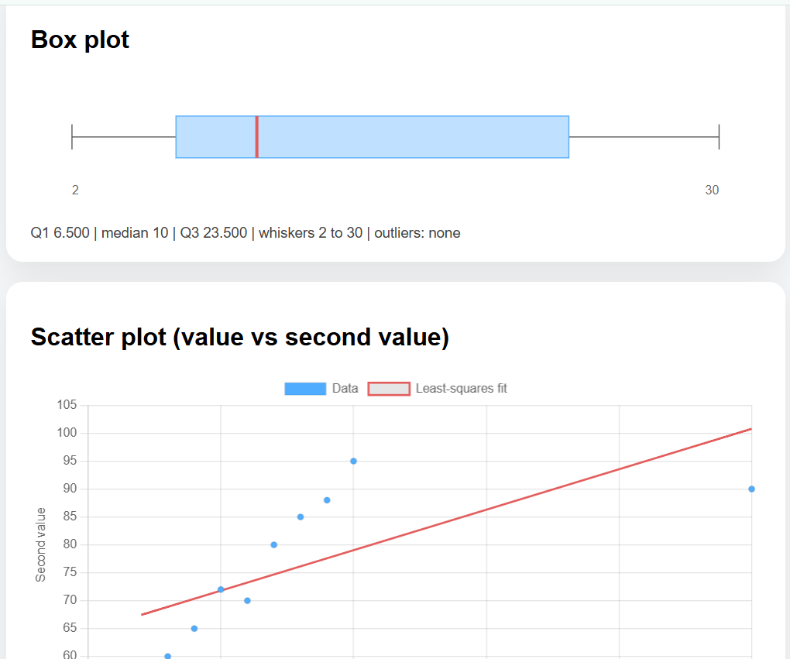

# Data Dashboard (Spring Boot + MySQL)

A full-stack web app for entering or uploading numeric data and exploring it with descriptive statistics and charts.

## Features
- Add data points manually or upload a CSV (`label,amount[,amount2]`)
- Descriptive statistics: count, mean, median, sample standard deviation, min, max, quartiles, skewness, excess kurtosis, 95% confidence interval for the mean
- Charts: bar chart, histogram (adjustable bins), box plot with outliers, scatter plot with least-squares line and Pearson correlation
- Data stored in MySQL through Spring Data JPA
- Export data or statistics as CSV

## Tech stack
Java 21, Spring Boot, Spring Data JPA, MySQL, Chart.js, HTML/JavaScript

## Screenshots


## Run locally
1. Create the database:
```sql
   CREATE DATABASE demo_db;
   CREATE USER 'demo_user'@'localhost' IDENTIFIED BY 'your_password';
   GRANT ALL PRIVILEGES ON demo_db.* TO 'demo_user'@'localhost';
```
2. Set the password as an environment variable:
    - PowerShell: `$env:DB_PASSWORD="your_password"`
    - macOS/Linux: `export DB_PASSWORD=your_password`
3. Start the app: `./mvnw spring-boot:run` (Windows: `mvnw.cmd spring-boot:run`), or run `DemoApplication` from your IDE.
4. Open http://localhost:8080/dashboard.html

## API
| Method | Endpoint | Description |
|---|---|---|
| GET | `/api/sales` | Labels and values for the bar chart |
| POST | `/api/sales` | Add a data point (`label`, `amount`, optional `amount2`) |
| DELETE | `/api/sales` | Delete all data |
| POST | `/api/upload` | Upload a CSV file |
| GET | `/api/stats` | Descriptive statistics |
| GET | `/api/analysis` | Skewness, kurtosis, 95% CI for the mean |
| GET | `/api/histogram?bins=N` | Histogram bins and counts |
| GET | `/api/boxplot` | Five-number summary and outliers |
| GET | `/api/scatter` | Points, correlation, and regression line |
| GET | `/api/export` | Download the data as CSV |

## Sample data
```
label,amount,amount2
A,2,55
B,3,60
C,4,65
```

## Ideas for next steps
- User accounts and per-user datasets
- More chart types and statistical tests
- Docker Compose setup with MySQL